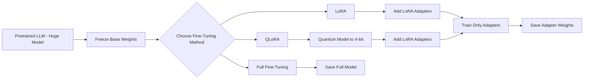

# 🚀 QLoRA Fine‑Tuning

***Efficient Fine‑Tuning of Large Language Models (LLMs)***

---

## 📌 **Overview**

Welcome to the **QLoRA Fine‑Tuning** repository! This project demonstrates how to fine‑tune large language models using **Parameter‑Efficient Fine‑Tuning (PEFT)** techniques — specifically **LoRA** and **QLoRA**.
Fine‑tuning enables adapting powerful pretrained models for specific tasks (like chat, classification, summarization, etc.) without needing massive GPU resources.

---

## 🤖 **What Is Fine‑Tuning?**

Fine‑tuning is the process of taking a pretrained LLM and adjusting it to perform well on a specific task or dataset. Unlike full training from scratch, fine‑tuning reuses the model’s learned knowledge, speeds up convergence, and often gives superior downstream performance.

However, large models (billions of parameters) can be **very expensive to fine‑tune normally** — requiring GPUs with huge memory. That’s where **PEFT techniques** come in. ([GeeksforGeeks][1])

---

## 🧠 **Parameter Efficient Fine‑Tuning (PEFT)**

PEFT methods aim to train only a **small subset of parameters** while keeping the majority frozen. This drastically reduces memory, compute, and storage costs.

👉 Key benefits of PEFT:
✔ Lower GPU memory usage
✔ Faster training times
✔ Enables fine‑tuning large models on consumer hardware

Many PEFT approaches exist (e.g., Adapter Tuning, Prefix Tuning). Two popular ones used here are:

---

## ⚙️ **LoRA (Low‑Rank Adaptation)**

**LoRA** introduces small, trainable low‑rank matrices into selected model layers instead of fine‑tuning all parameters.
Instead of full parameter updates, it factorizes fine‑tuning weight updates into low‑rank matrices, dramatically reducing trainable parameters and memory usage. ([rishijeet.github.io][2])

✔ Only adapter weights are trained
✔ Base model remains frozen
✔ Efficient training and fast experimentation

---

## 💡 **QLoRA (Quantized Low‑Rank Adaptation)**

**QLoRA** builds on LoRA by also quantizing the base model weights to **4‑bit precision** — further minimizing GPU memory requirements while still training LoRA adapters in high precision. ([GeeksforGeeks][1])

📌 Main advantages:

* Massive models can be fine‑tuned on **single GPUs**
* Significant memory reduction (e.g., 70B model on consumer hardware)
* Near‑full fine‑tuning performance with dramatically fewer resources

---

## 🔍 **How It Works**

Below is a **Mermaid diagram** illustrating the fine‑tuning workflow with PEFT, LoRA, and QLoRA:

---

## 🧩 **Key Concepts Summary**

### 📌 Full Fine‑Tuning

* Updates **all model weights**
* Very expensive memory + compute

### 📌 LoRA

* Adds **trainable low‑rank adapters**
* Freezes main weights
* Huge training savings

### 📌 QLoRA

* Quantizes base model to 4‑bit
* Trains LoRA adapters
* Best balance: **Memory Efficiency + Performance**

---

## 🎯 **Use Cases**

Fine‑tuning with LoRA or QLoRA is ideal for:
✅ Custom chatbots
✅ Domain‑specific text generation
✅ Sentiment analysis
✅ Code generation models
✅ Low‑resource machine deployments
